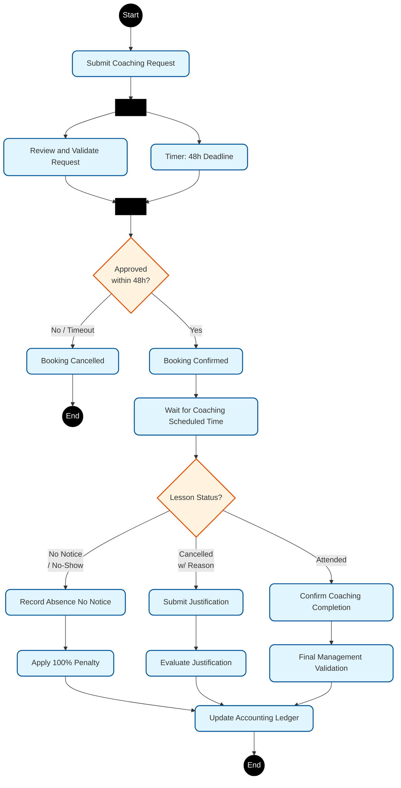

```mermaid
flowchart TD
    %% Estilos UML
    classDef action fill:#e1f5fe,stroke:#01579b,stroke-width:2px,rx:10px,ry:10px;
    classDef decision fill:#fff3e0,stroke:#e65100,stroke-width:2px;
    classDef bar fill:#000,stroke:#000,stroke-width:6px,color:#fff;
    classDef startend fill:#000,stroke:#000,color:#fff;

    Start((Start)):::startend --> A1[Submit Coaching Request]:::action
    
    %% Fork
    A1 --> Fork1[          ]:::bar
    
    Fork1 --> A2[Review and Validate Request]:::action
    Fork1 --> A3[Timer: 48h Deadline]:::action
    
    %% Join
    A2 --> Join1[          ]:::bar
    A3 --> Join1
    
    %% Gateway 1: Validação inicial
    Join1 --> D1{Approved <br> within 48h?}:::decision
    
    D1 -- No / Timeout --> A4[Booking Cancelled]:::action
    A4 --> End1((End)):::startend
    
    D1 -- Yes --> A5[Booking Confirmed]:::action
    A5 --> A6[Wait for Coaching Scheduled Time]:::action
    
    %% Gateway 2: Gestão de Presenças baseada no BPMN do Pedro
    A6 --> D2{Lesson Status?}:::decision
    
    D2 -- Attended --> A11[Confirm Coaching Completion]:::action
    
    %% Retângulo "Verify Execution" removido - liga direto à Final Management
    A11 --> A13[Final Management Validation]:::action
    
    D2 -- Cancelled <br> w/ Reason --> A9[Submit Justification]:::action
    A9 --> A10[Evaluate Justification]:::action
    
    D2 -- No Notice <br> / No-Show --> A7[Record Absence No Notice]:::action
    A7 --> A8[Apply 100% Penalty]:::action
    
    %% Fecho no Faturamento (Accounting Ledger)
    A8 --> A14[Update Accounting Ledger]:::action
    A10 --> A14
    A13 --> A14
    
    A14 --> End2((End)):::startend
```