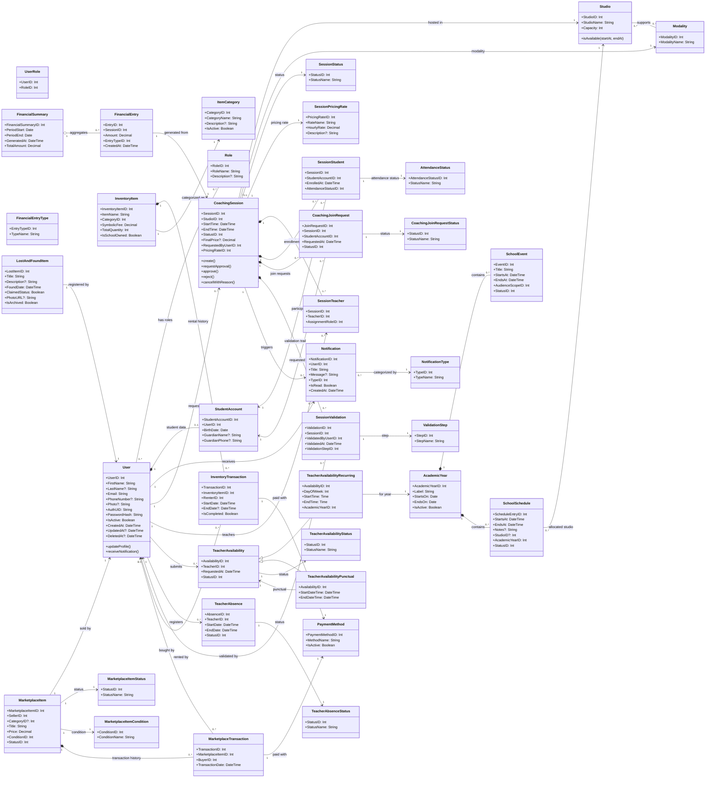

```mermaid
classDiagram
	direction LR

	class Role {
		+RoleID: Int
		+RoleName: String
		+Description?: String
	}

	class User {
		+UserID: Int
		+FirstName: String
		+LastName?: String
		+Email: String
		+PhoneNumber?: String
		+Photo?: String
		+AuthUID: String
		+PasswordHash: String
		+IsActive: Boolean
		+CreatedAt: DateTime
		+UpdatedAt?: DateTime
		+DeletedAt?: DateTime
		+updateProfile()
		+receiveNotification()
	}

	class UserRole {
		+UserID: Int
		+RoleID: Int
	}

	class StudentAccount {
		+StudentAccountID: Int
		+UserID: Int
		+BirthDate: Date
		+GuardianName?: String
		+GuardianPhone?: String
	}

	class Studio {
		+StudioID: Int
		+StudioName: String
		+Capacity: Int
		+isAvailable(startAt, endAt)
	}

	class Modality {
		+ModalityID: Int
		+ModalityName: String
	}

	class CoachingSession {
		+SessionID: Int
		+StudioID: Int
		+StartTime: DateTime
		+EndTime: DateTime
		+StatusID: Int
		+FinalPrice?: Decimal
		+RequestedByUserID: Int
		+PricingRateID: Int
		+create()
		+requestApproval()
		+approve()
		+reject()
		+cancelWithReason()
	}

	class SessionStatus {
		+StatusID: Int
		+StatusName: String
	}

	class SessionPricingRate {
		+PricingRateID: Int
		+RateName: String
		+HourlyRate: Decimal
		+Description?: String
	}

	class SessionStudent {
		+SessionID: Int
		+StudentAccountID: Int
		+EnrolledAt: DateTime
		+AttendanceStatusID: Int
	}

	class AttendanceStatus {
		+AttendanceStatusID: Int
		+StatusName: String
	}

	class SessionTeacher {
		+SessionID: Int
		+TeacherID: Int
		+AssignmentRoleID: Int
	}

	class CoachingJoinRequest {
		+JoinRequestID: Int
		+SessionID: Int
		+StudentAccountID: Int
		+RequestedAt: DateTime
		+StatusID: Int
	}

	class CoachingJoinRequestStatus {
		+StatusID: Int
		+StatusName: String
	}

	class SessionValidation {
		+ValidationID: Int
		+SessionID: Int
		+ValidatedByUserID: Int
		+ValidatedAt: DateTime
		+ValidationStepID: Int
	}

	class ValidationStep {
		+StepID: Int
		+StepName: String
	}

	class TeacherAvailability {
		+AvailabilityID: Int
		+TeacherID: Int
		+RequestedAt: DateTime
		+StatusID: Int
	}

	class TeacherAvailabilityStatus {
		+StatusID: Int
		+StatusName: String
	}

	class TeacherAvailabilityRecurring {
		+AvailabilityID: Int
		+DayOfWeek: Int
		+StartTime: Time
		+EndTime: Time
		+AcademicYearID: Int
	}

	class TeacherAvailabilityPunctual {
		+AvailabilityID: Int
		+StartDateTime: DateTime
		+EndDateTime: DateTime
	}

	class TeacherAbsence {
		+AbsenceID: Int
		+TeacherID: Int
		+StartDate: DateTime
		+EndDate: DateTime
		+StatusID: Int
	}

	class TeacherAbsenceStatus {
		+StatusID: Int
		+StatusName: String
	}

	class Notification {
		+NotificationID: Int
		+UserID: Int
		+Title: String
		+Message?: String
		+TypeID: Int
		+IsRead: Boolean
		+CreatedAt: DateTime
	}

	class NotificationType {
		+TypeID: Int
		+TypeName: String
	}

	class PaymentMethod {
		+PaymentMethodID: Int
		+MethodName: String
		+IsActive: Boolean
	}

	class ItemCategory {
		+CategoryID: Int
		+CategoryName: String
		+Description?: String
		+IsActive: Boolean
	}

	class InventoryItem {
		+InventoryItemID: Int
		+ItemName: String
		+CategoryID: Int
		+SymbolicFee: Decimal
		+TotalQuantity: Int
		+IsSchoolOwned: Boolean
	}

	class InventoryTransaction {
		+TransactionID: Int
		+InventoryItemID: Int
		+RenterID: Int
		+StartDate: DateTime
		+EndDate?: DateTime
		+IsCompleted: Boolean
	}

	class MarketplaceItem {
		+MarketplaceItemID: Int
		+SellerID: Int
		+CategoryID?: Int
		+Title: String
		+Price: Decimal
		+ConditionID: Int
		+StatusID: Int
	}

	class MarketplaceItemCondition {
		+ConditionID: Int
		+ConditionName: String
	}

	class MarketplaceItemStatus {
		+StatusID: Int
		+StatusName: String
	}

	class MarketplaceTransaction {
		+TransactionID: Int
		+MarketplaceItemID: Int
		+BuyerID: Int
		+TransactionDate: DateTime
	}

	class FinancialEntry {
		+EntryID: Int
		+SessionID: Int
		+Amount: Decimal
		+EntryTypeID: Int
		+CreatedAt: DateTime
	}

	class FinancialEntryType {
		+EntryTypeID: Int
		+TypeName: String
	}

	class FinancialSummary {
		+FinancialSummaryID: Int
		+PeriodStart: Date
		+PeriodEnd: Date
		+GeneratedAt: DateTime
		+TotalAmount: Decimal
	}

	class AcademicYear {
		+AcademicYearID: Int
		+Label: String
		+StartsOn: Date
		+EndsOn: Date
		+IsActive: Boolean
	}

	class SchoolEvent {
		+EventID: Int
		+Title: String
		+StartsAt: DateTime
		+EndsAt: DateTime
		+AudienceScopeID: Int
		+StatusID: Int
	}

	class SchoolSchedule {
		+ScheduleEntryID: Int
		+StartsAt: DateTime
		+EndsAt: DateTime
		+Notes?: String
		+StudioID?: Int
		+AcademicYearID: Int
		+StatusID: Int
	}

	class LostAndFoundItem {
		+LostItemID: Int
		+Title: String
		+Description?: String
		+FoundDate: DateTime
		+ClaimedStatus: Boolean
		+PhotoURL?: String
		+IsArchived: Boolean
	}

	User "0..*" -- "0..*" Role : has roles
	User "1" *-- "0..1" StudentAccount : student data
	User "1" --> "0..*" Notification : receives
	User "1" --> "0..*" CoachingSession : requests
	User "1" --> "0..*" SessionTeacher : teaches
	User "1" --> "0..*" TeacherAvailability : submits
	User "1" --> "0..*" TeacherAbsence : registers

	Notification "0..*" --> "1" NotificationType : categorized by

	Studio "0..*" -- "0..*" Modality : supports
	CoachingSession "1" --> "1" Studio : hosted in
	CoachingSession "1" --> "1" Modality : modality
	CoachingSession "1" --> "1" SessionStatus : status
	CoachingSession "1" --> "1" SessionPricingRate : pricing rate
	CoachingSession "1" *-- "1..*" SessionTeacher : teachers
	CoachingSession "1" *-- "0..*" SessionStudent : enrollments
	SessionStudent "1" --> "1" AttendanceStatus : attendance status
	CoachingSession "1" *-- "0..*" CoachingJoinRequest : join requests
	CoachingJoinRequest "1" --> "1" CoachingJoinRequestStatus : status
	CoachingSession "1" *-- "0..*" SessionValidation : validation trail
	SessionValidation "1" --> "1" ValidationStep : step
	CoachingSession "1" --> "0..*" Notification : triggers
	StudentAccount "1" <-- "0..*" SessionStudent : participant
	StudentAccount "1" <-- "0..*" CoachingJoinRequest : requested by
	User "1" <-- "0..*" SessionValidation : validated by

	TeacherAvailability <|-- TeacherAvailabilityRecurring
	TeacherAvailability <|-- TeacherAvailabilityPunctual
	TeacherAvailability "1" --> "1" TeacherAvailabilityStatus : status
	TeacherAvailabilityRecurring --> "1" AcademicYear : for year
	TeacherAvailabilityPunctual --> "1" TeacherAvailability : punctual
	TeacherAbsence "1" --> "1" TeacherAbsenceStatus : status

	InventoryItem "1" *-- "0..*" InventoryTransaction : rental history
	InventoryItem "1" --> "1" ItemCategory : categorized as
	User "1" <-- "0..*" InventoryTransaction : rented by
	InventoryTransaction "1" --> "1" PaymentMethod : paid with

	MarketplaceItem "1" --> "1" User : sold by
	MarketplaceItem "1" --> "1" MarketplaceItemStatus : status
	MarketplaceItem "1" --> "1" MarketplaceItemCondition : condition
	MarketplaceItem "1" *-- "0..*" MarketplaceTransaction : transaction history
	User "1" <-- "0..*" MarketplaceTransaction : bought by
	MarketplaceTransaction "1" --> "1" PaymentMethod : paid with

	FinancialSummary "1" o-- "0..*" FinancialEntry : aggregates
	FinancialEntry "1" --> "1" CoachingSession : generated from

	AcademicYear "1" *-- "0..*" SchoolEvent : contains
	AcademicYear "1" *-- "0..*" SchoolSchedule : contains
	SchoolSchedule "0..*" --> "1" Studio : allocated studio
	LostAndFoundItem "1" --> "1" User : registered by
```