## SD-01: User Authentication

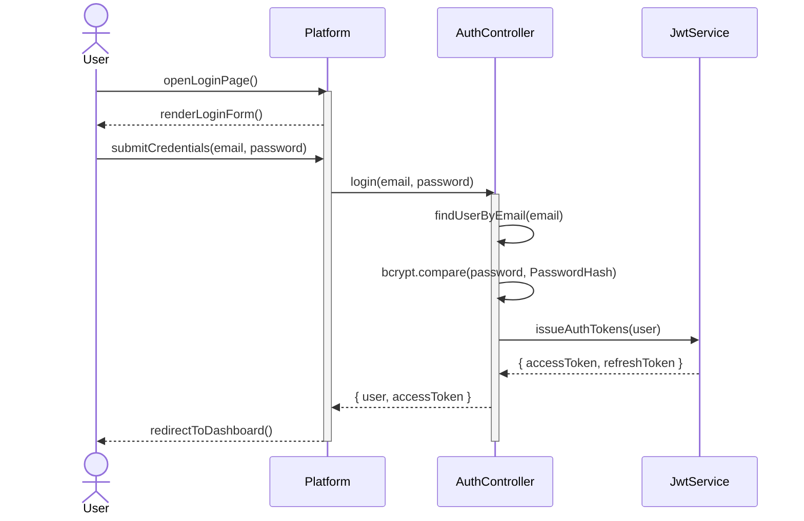
```mermaid
sequenceDiagram
    actor User
    participant Platform as Platform
    participant AuthController as AuthController
    participant JwtService as JwtService

    User->>Platform: openLoginPage()
    activate Platform
    Platform-->>User: renderLoginForm()
    User->>Platform: submitCredentials(email, password)
    Platform->>AuthController: login(email, password)
    activate AuthController
    AuthController->>AuthController: findUserByEmail(email)
    AuthController->>AuthController: bcrypt.compare(password, PasswordHash)
    AuthController->>JwtService: issueAuthTokens(user)
    JwtService-->>AuthController: { accessToken, refreshToken }
    AuthController-->>Platform: { user, accessToken }
    Platform-->>User: redirectToDashboard()
    deactivate AuthController
    deactivate Platform
```

---

## SD-02: Coaching Session Booking Request

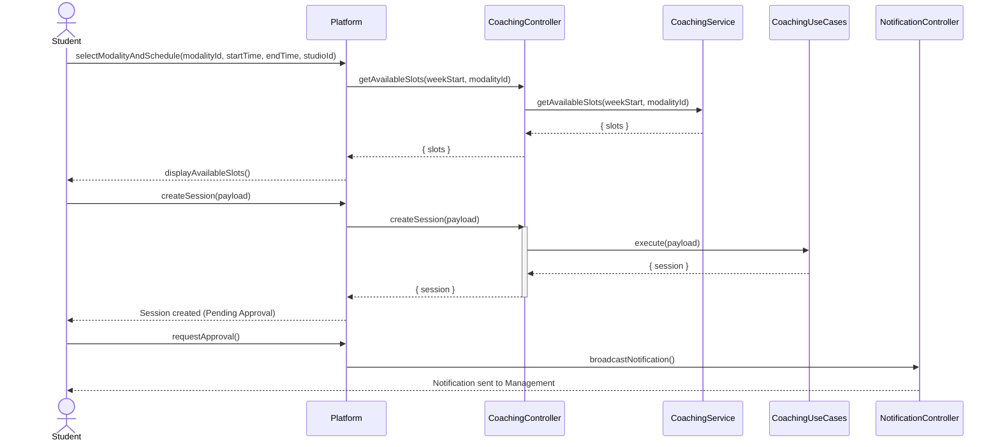
```mermaid
sequenceDiagram
    actor Student
    participant Platform as Platform
    participant CoachingController as CoachingController
    participant CoachingService as CoachingService
    participant CoachingUseCases as CoachingUseCases
    participant NotificationController as NotificationController

    Student->>Platform: selectModalityAndSchedule(modalityId, startTime, endTime, studioId)
    Platform->>CoachingController: getAvailableSlots(weekStart, modalityId)
    CoachingController->>CoachingService: getAvailableSlots(weekStart, modalityId)
    CoachingService-->>CoachingController: { slots }
    CoachingController-->>Platform: { slots }
    Platform-->>Student: displayAvailableSlots()

    Student->>Platform: createSession(payload)
    Platform->>CoachingController: createSession(payload)
    activate CoachingController
    CoachingController->>CoachingUseCases: execute(payload)
    CoachingUseCases-->>CoachingController: { session }
    CoachingController-->>Platform: { session }
    deactivate CoachingController
    Platform-->>Student: Session created (Pending Approval)

    Student->>Platform: requestApproval()
    Platform->>NotificationController: broadcastNotification()
    NotificationController-->>Student: Notification sent to Management
```

---

## SD-03: Post-Coaching Double Validation

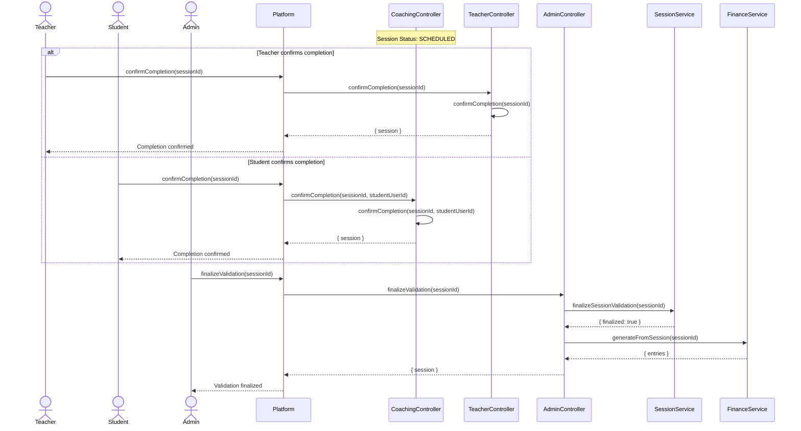
```mermaid
sequenceDiagram
    actor Teacher
    actor Student
    actor Admin
    participant Platform as Platform
    participant CoachingController as CoachingController
    participant TeacherController as TeacherController
    participant AdminController as AdminController
    participant SessionService as SessionService
    participant FinanceService as FinanceService

    Note over CoachingController: Session Status: SCHEDULED

    alt Teacher confirms completion
        Teacher->>Platform: confirmCompletion(sessionId)
        Platform->>TeacherController: confirmCompletion(sessionId)
        TeacherController->>TeacherController: confirmCompletion(sessionId)
        TeacherController-->>Platform: { session }
        Platform-->>Teacher: Completion confirmed
    else Student confirms completion
        Student->>Platform: confirmCompletion(sessionId)
        Platform->>CoachingController: confirmCompletion(sessionId, studentUserId)
        CoachingController->>CoachingController: confirmCompletion(sessionId, studentUserId)
        CoachingController-->>Platform: { session }
        Platform-->>Student: Completion confirmed
    end

    Admin->>Platform: finalizeValidation(sessionId)
    Platform->>AdminController: finalizeValidation(sessionId)
    AdminController->>SessionService: finalizeSessionValidation(sessionId)
    SessionService-->>AdminController: { finalized: true }
    AdminController->>FinanceService: generateFromSession(sessionId)
    FinanceService-->>AdminController: { entries }
    AdminController-->>Platform: { session }
    Platform-->>Admin: Validation finalized
```

---

## SD-04: Session Cancellation with Justification

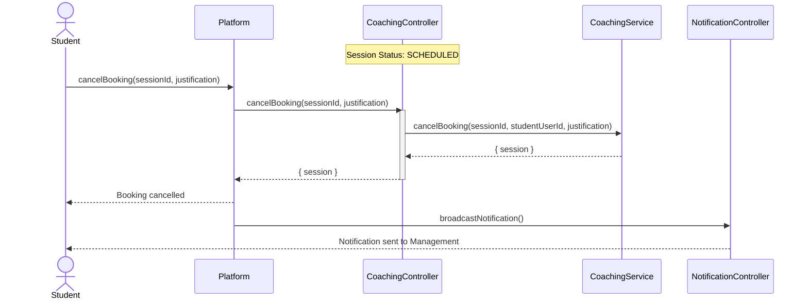
```mermaid
sequenceDiagram
    actor Student
    participant Platform as Platform
    participant CoachingController as CoachingController
    participant CoachingService as CoachingService
    participant NotificationController as NotificationController

    Note over CoachingController: Session Status: SCHEDULED
    Student->>Platform: cancelBooking(sessionId, justification)
    Platform->>CoachingController: cancelBooking(sessionId, justification)
    activate CoachingController
    CoachingController->>CoachingService: cancelBooking(sessionId, studentUserId, justification)
    CoachingService-->>CoachingController: { session }
    CoachingController-->>Platform: { session }
    deactivate CoachingController
    Platform-->>Student: Booking cancelled

    Platform->>NotificationController: broadcastNotification()
    NotificationController-->>Student: Notification sent to Management
```

---

## SD-05: No-Show Recording

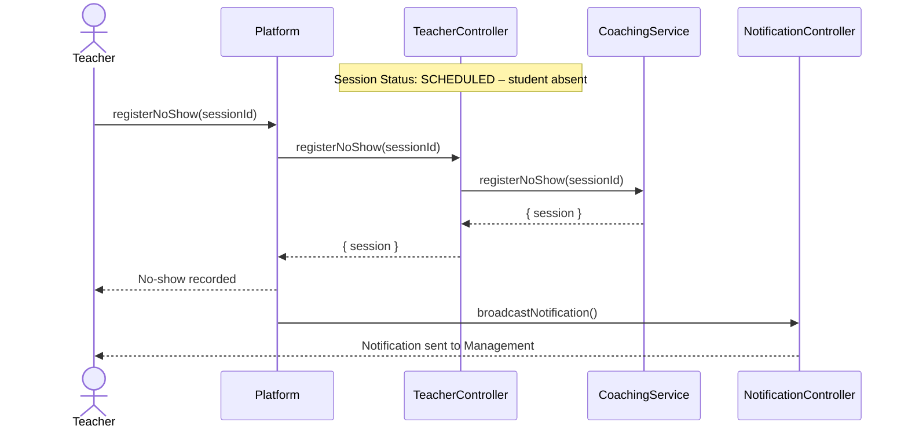
```mermaid
sequenceDiagram
    actor Teacher
    participant Platform as Platform
    participant TeacherController as TeacherController
    participant CoachingService as CoachingService
    participant NotificationController as NotificationController

    Note over TeacherController: Session Status: SCHEDULED – student absent
    Teacher->>Platform: registerNoShow(sessionId)
    Platform->>TeacherController: registerNoShow(sessionId)
    TeacherController->>CoachingService: registerNoShow(sessionId)
    CoachingService-->>TeacherController: { session }
    TeacherController-->>Platform: { session }
    Platform-->>Teacher: No-show recorded

    Platform->>NotificationController: broadcastNotification()
    NotificationController-->>Teacher: Notification sent to Management
```

---

## SD-06: Student Join Request to Existing Session

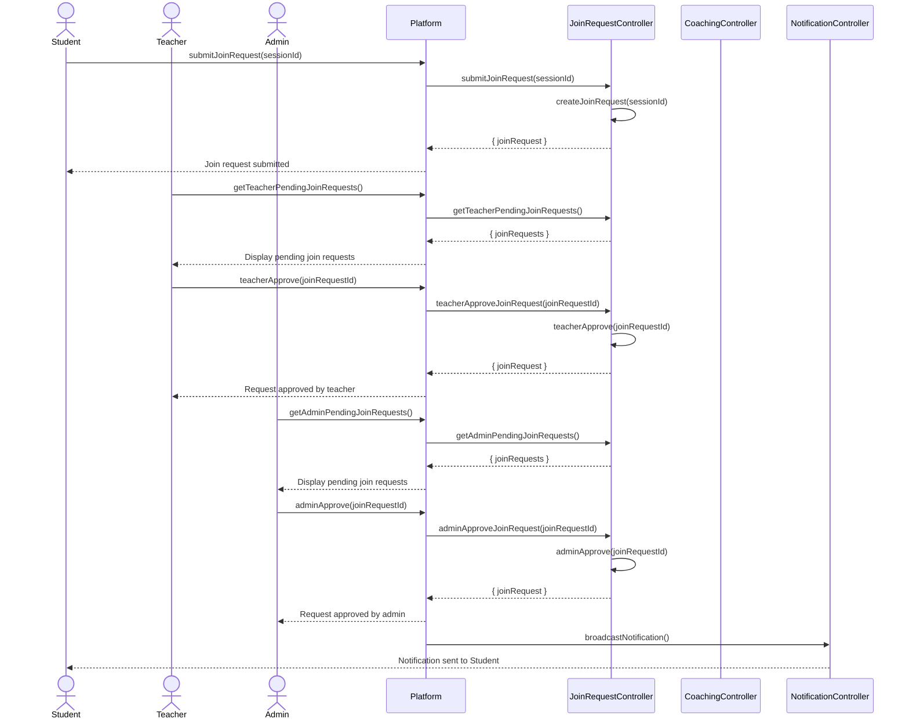
```mermaid
sequenceDiagram
    actor Student
    actor Teacher
    actor Admin
    participant Platform as Platform
    participant JoinRequestController as JoinRequestController
    participant CoachingController as CoachingController
    participant NotificationController as NotificationController

    Student->>Platform: submitJoinRequest(sessionId)
    Platform->>JoinRequestController: submitJoinRequest(sessionId)
    JoinRequestController->>JoinRequestController: createJoinRequest(sessionId)
    JoinRequestController-->>Platform: { joinRequest }
    Platform-->>Student: Join request submitted

    Teacher->>Platform: getTeacherPendingJoinRequests()
    Platform->>JoinRequestController: getTeacherPendingJoinRequests()
    JoinRequestController-->>Platform: { joinRequests }
    Platform-->>Teacher: Display pending join requests

    Teacher->>Platform: teacherApprove(joinRequestId)
    Platform->>JoinRequestController: teacherApproveJoinRequest(joinRequestId)
    JoinRequestController->>JoinRequestController: teacherApprove(joinRequestId)
    JoinRequestController-->>Platform: { joinRequest }
    Platform-->>Teacher: Request approved by teacher

    Admin->>Platform: getAdminPendingJoinRequests()
    Platform->>JoinRequestController: getAdminPendingJoinRequests()
    JoinRequestController-->>Platform: { joinRequests }
    Platform-->>Admin: Display pending join requests

    Admin->>Platform: adminApprove(joinRequestId)
    Platform->>JoinRequestController: adminApproveJoinRequest(joinRequestId)
    JoinRequestController->>JoinRequestController: adminApprove(joinRequestId)
    JoinRequestController-->>Platform: { joinRequest }
    Platform-->>Admin: Request approved by admin

    Platform->>NotificationController: broadcastNotification()
    NotificationController-->>Student: Notification sent to Student
```

---

## SD-07: Teacher Availability Setup

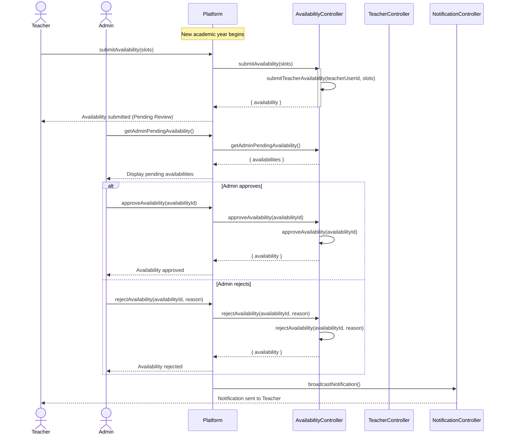
```mermaid
sequenceDiagram
    actor Teacher
    actor Admin
    participant Platform as Platform
    participant AvailabilityController as AvailabilityController
    participant TeacherController as TeacherController
    participant NotificationController as NotificationController

    Note over Platform: New academic year begins
    Teacher->>Platform: submitAvailability(slots)
    Platform->>AvailabilityController: submitAvailability(slots)
    activate AvailabilityController
    AvailabilityController->>AvailabilityController: submitTeacherAvailability(teacherUserId, slots)
    AvailabilityController-->>Platform: { availability }
    deactivate AvailabilityController
    Platform-->>Teacher: Availability submitted (Pending Review)

    Admin->>Platform: getAdminPendingAvailability()
    Platform->>AvailabilityController: getAdminPendingAvailability()
    AvailabilityController-->>Platform: { availabilities }
    Platform-->>Admin: Display pending availabilities

    alt Admin approves
        Admin->>Platform: approveAvailability(availabilityId)
        Platform->>AvailabilityController: approveAvailability(availabilityId)
        AvailabilityController->>AvailabilityController: approveAvailability(availabilityId)
        AvailabilityController-->>Platform: { availability }
        Platform-->>Admin: Availability approved
    else Admin rejects
        Admin->>Platform: rejectAvailability(availabilityId, reason)
        Platform->>AvailabilityController: rejectAvailability(availabilityId, reason)
        AvailabilityController->>AvailabilityController: rejectAvailability(availabilityId, reason)
        AvailabilityController-->>Platform: { availability }
        Platform-->>Admin: Availability rejected
    end

    Platform->>NotificationController: broadcastNotification()
    NotificationController-->>Teacher: Notification sent to Teacher
```

---

## SD-08: School Inventory Rental

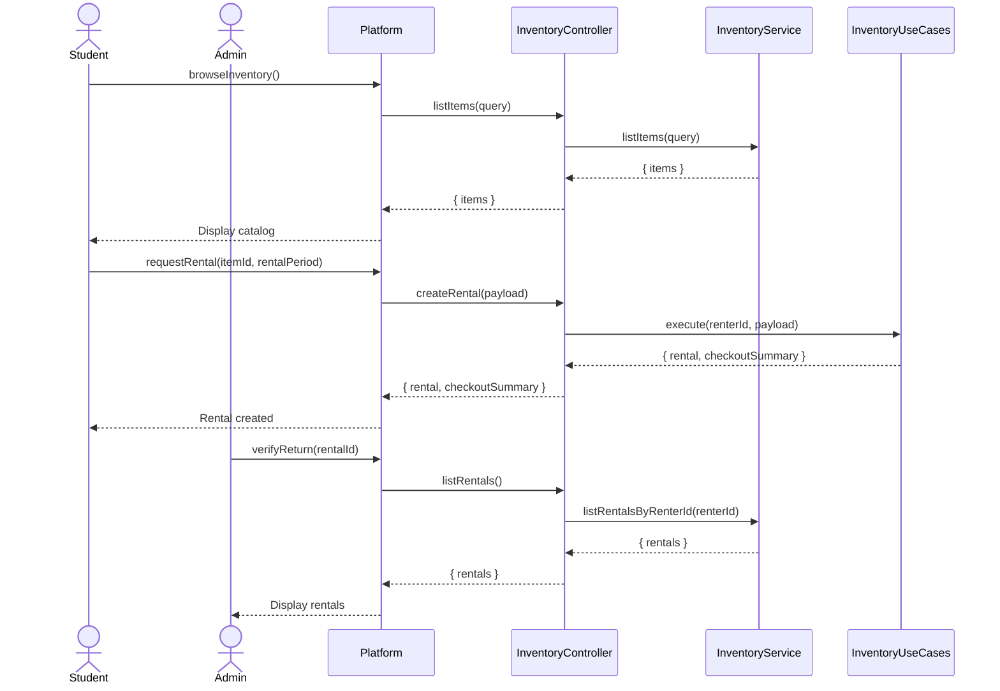
```mermaid
sequenceDiagram
    actor Student
    actor Admin
    participant Platform as Platform
    participant InventoryController as InventoryController
    participant InventoryService as InventoryService
    participant InventoryUseCases as InventoryUseCases

    Student->>Platform: browseInventory()
    Platform->>InventoryController: listItems(query)
    InventoryController->>InventoryService: listItems(query)
    InventoryService-->>InventoryController: { items }
    InventoryController-->>Platform: { items }
    Platform-->>Student: Display catalog

    Student->>Platform: requestRental(itemId, rentalPeriod)
    Platform->>InventoryController: createRental(payload)
    InventoryController->>InventoryUseCases: execute(renterId, payload)
    InventoryUseCases-->>InventoryController: { rental, checkoutSummary }
    InventoryController-->>Platform: { rental, checkoutSummary }
    Platform-->>Student: Rental created

    Admin->>Platform: verifyReturn(rentalId)
    Platform->>InventoryController: listRentals()
    InventoryController->>InventoryService: listRentalsByRenterId(renterId)
    InventoryService-->>InventoryController: { rentals }
    InventoryController-->>Platform: { rentals }
    Platform-->>Admin: Display rentals
```

---

## SD-09: Community Marketplace Transaction

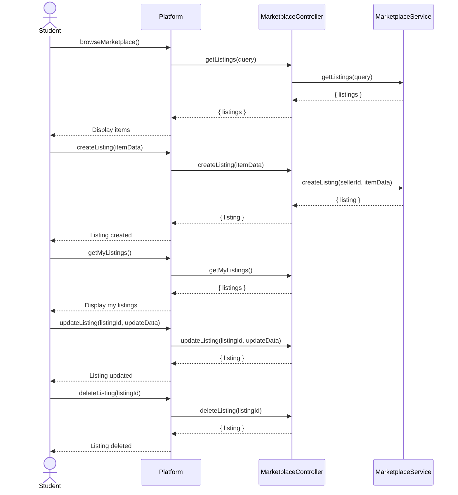
```mermaid
sequenceDiagram
    actor Student
    participant Platform as Platform
    participant MarketplaceController as MarketplaceController
    participant MarketplaceService as MarketplaceService

    Student->>Platform: browseMarketplace()
    Platform->>MarketplaceController: getListings(query)
    MarketplaceController->>MarketplaceService: getListings(query)
    MarketplaceService-->>MarketplaceController: { listings }
    MarketplaceController-->>Platform: { listings }
    Platform-->>Student: Display items

    Student->>Platform: createListing(itemData)
    Platform->>MarketplaceController: createListing(itemData)
    MarketplaceController->>MarketplaceService: createListing(sellerId, itemData)
    MarketplaceService-->>MarketplaceController: { listing }
    MarketplaceController-->>Platform: { listing }
    Platform-->>Student: Listing created

    Student->>Platform: getMyListings()
    Platform->>MarketplaceController: getMyListings()
    MarketplaceController-->>Platform: { listings }
    Platform-->>Student: Display my listings

    Student->>Platform: updateListing(listingId, updateData)
    Platform->>MarketplaceController: updateListing(listingId, updateData)
    MarketplaceController-->>Platform: { listing }
    Platform-->>Student: Listing updated

    Student->>Platform: deleteListing(listingId)
    Platform->>MarketplaceController: deleteListing(listingId)
    MarketplaceController-->>Platform: { listing }
    Platform-->>Student: Listing deleted
```

---

## SD-10: Financial Summary Generation and Export

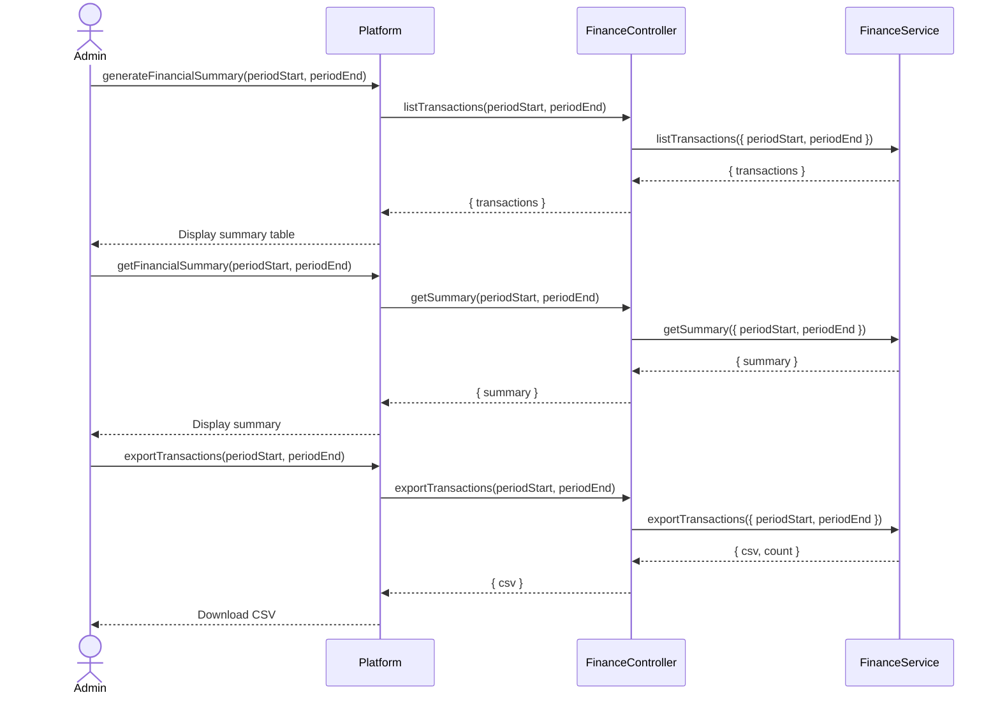
```mermaid
sequenceDiagram
    actor Admin
    participant Platform as Platform
    participant FinanceController as FinanceController
    participant FinanceService as FinanceService

    Admin->>Platform: generateFinancialSummary(periodStart, periodEnd)
    Platform->>FinanceController: listTransactions(periodStart, periodEnd)
    FinanceController->>FinanceService: listTransactions({ periodStart, periodEnd })
    FinanceService-->>FinanceController: { transactions }
    FinanceController-->>Platform: { transactions }
    Platform-->>Admin: Display summary table

    Admin->>Platform: getFinancialSummary(periodStart, periodEnd)
    Platform->>FinanceController: getSummary(periodStart, periodEnd)
    FinanceController->>FinanceService: getSummary({ periodStart, periodEnd })
    FinanceService-->>FinanceController: { summary }
    FinanceController-->>Platform: { summary }
    Platform-->>Admin: Display summary

    Admin->>Platform: exportTransactions(periodStart, periodEnd)
    Platform->>FinanceController: exportTransactions(periodStart, periodEnd)
    FinanceController->>FinanceService: exportTransactions({ periodStart, periodEnd })
    FinanceService-->>FinanceController: { csv, count }
    FinanceController-->>Platform: { csv }
    Platform-->>Admin: Download CSV
```

---

## SD-11: Lost and Found – Manage and View

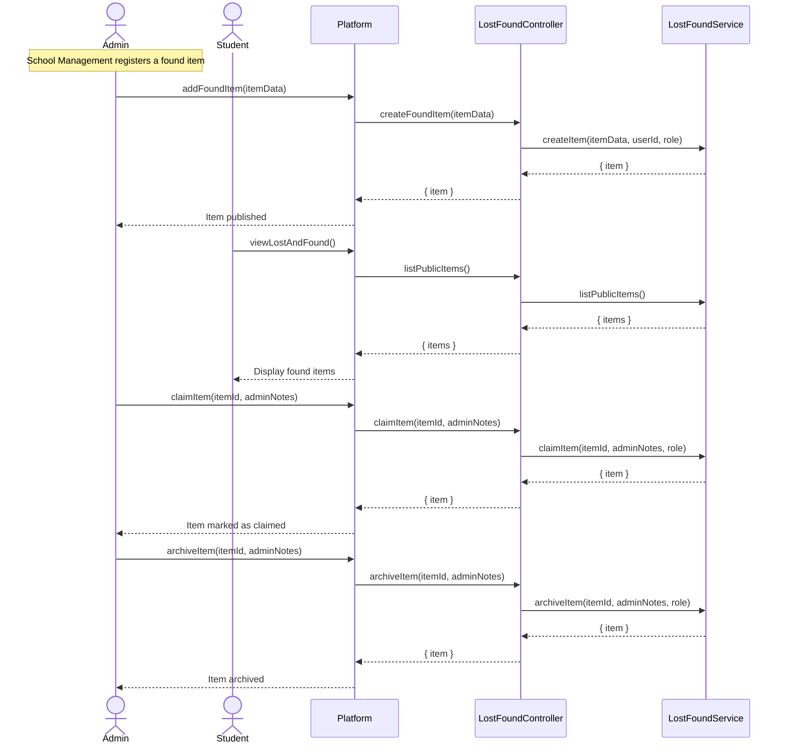
```mermaid
sequenceDiagram
    actor Admin
    actor Student
    participant Platform as Platform
    participant LostFoundController as LostFoundController
    participant LostFoundService as LostFoundService

    Note over Admin: School Management registers a found item
    Admin->>Platform: addFoundItem(itemData)
    Platform->>LostFoundController: createFoundItem(itemData)
    LostFoundController->>LostFoundService: createItem(itemData, userId, role)
    LostFoundService-->>LostFoundController: { item }
    LostFoundController-->>Platform: { item }
    Platform-->>Admin: Item published

    Student->>Platform: viewLostAndFound()
    Platform->>LostFoundController: listPublicItems()
    LostFoundController->>LostFoundService: listPublicItems()
    LostFoundService-->>LostFoundController: { items }
    LostFoundController-->>Platform: { items }
    Platform-->>Student: Display found items

    Admin->>Platform: claimItem(itemId, adminNotes)
    Platform->>LostFoundController: claimItem(itemId, adminNotes)
    LostFoundController->>LostFoundService: claimItem(itemId, adminNotes, role)
    LostFoundService-->>LostFoundController: { item }
    LostFoundController-->>Platform: { item }
    Platform-->>Admin: Item marked as claimed

    Admin->>Platform: archiveItem(itemId, adminNotes)
    Platform->>LostFoundController: archiveItem(itemId, adminNotes)
    LostFoundController->>LostFoundService: archiveItem(itemId, adminNotes, role)
    LostFoundService-->>LostFoundController: { item }
    LostFoundController-->>Platform: { item }
    Platform-->>Admin: Item archived
```

---

## SD-12: Admin User Management

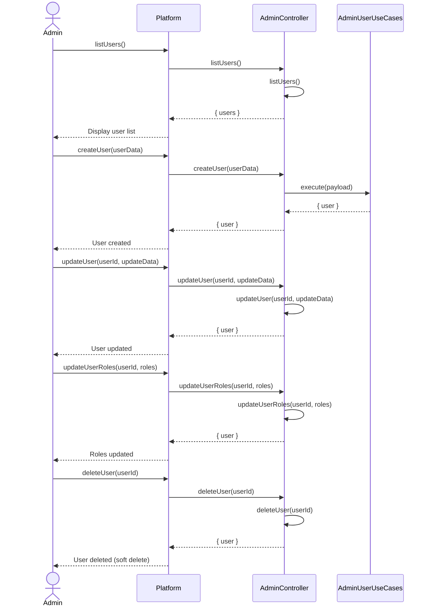
```mermaid
sequenceDiagram
    actor Admin
    participant Platform as Platform
    participant AdminController as AdminController
    participant AdminUserUseCases as AdminUserUseCases

    Admin->>Platform: listUsers()
    Platform->>AdminController: listUsers()
    AdminController->>AdminController: listUsers()
    AdminController-->>Platform: { users }
    Platform-->>Admin: Display user list

    Admin->>Platform: createUser(userData)
    Platform->>AdminController: createUser(userData)
    AdminController->>AdminUserUseCases: execute(payload)
    AdminUserUseCases-->>AdminController: { user }
    AdminController-->>Platform: { user }
    Platform-->>Admin: User created

    Admin->>Platform: updateUser(userId, updateData)
    Platform->>AdminController: updateUser(userId, updateData)
    AdminController->>AdminController: updateUser(userId, updateData)
    AdminController-->>Platform: { user }
    Platform-->>Admin: User updated

    Admin->>Platform: updateUserRoles(userId, roles)
    Platform->>AdminController: updateUserRoles(userId, roles)
    AdminController->>AdminController: updateUserRoles(userId, roles)
    AdminController-->>Platform: { user }
    Platform-->>Admin: Roles updated

    Admin->>Platform: deleteUser(userId)
    Platform->>AdminController: deleteUser(userId)
    AdminController->>AdminController: deleteUser(userId)
    AdminController-->>Platform: { user }
    Platform-->>Admin: User deleted (soft delete)
```

---

## SD-13: Teacher Admission Request Review

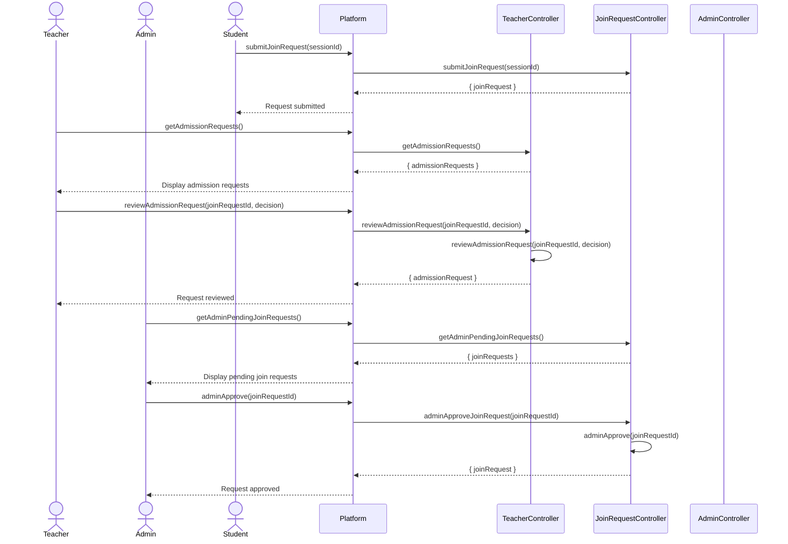
```mermaid
sequenceDiagram
    actor Teacher
    actor Admin
    actor Student
    participant Platform as Platform
    participant TeacherController as TeacherController
    participant JoinRequestController as JoinRequestController
    participant AdminController as AdminController

    Student->>Platform: submitJoinRequest(sessionId)
    Platform->>JoinRequestController: submitJoinRequest(sessionId)
    JoinRequestController-->>Platform: { joinRequest }
    Platform-->>Student: Request submitted

    Teacher->>Platform: getAdmissionRequests()
    Platform->>TeacherController: getAdmissionRequests()
    TeacherController-->>Platform: { admissionRequests }
    Platform-->>Teacher: Display admission requests

    Teacher->>Platform: reviewAdmissionRequest(joinRequestId, decision)
    Platform->>TeacherController: reviewAdmissionRequest(joinRequestId, decision)
    TeacherController->>TeacherController: reviewAdmissionRequest(joinRequestId, decision)
    TeacherController-->>Platform: { admissionRequest }
    Platform-->>Teacher: Request reviewed

    Admin->>Platform: getAdminPendingJoinRequests()
    Platform->>JoinRequestController: getAdminPendingJoinRequests()
    JoinRequestController-->>Platform: { joinRequests }
    Platform-->>Admin: Display pending join requests

    Admin->>Platform: adminApprove(joinRequestId)
    Platform->>JoinRequestController: adminApproveJoinRequest(joinRequestId)
    JoinRequestController->>JoinRequestController: adminApprove(joinRequestId)
    JoinRequestController-->>Platform: { joinRequest }
    Platform-->>Admin: Request approved
```

---

## SD-14: Notification Management

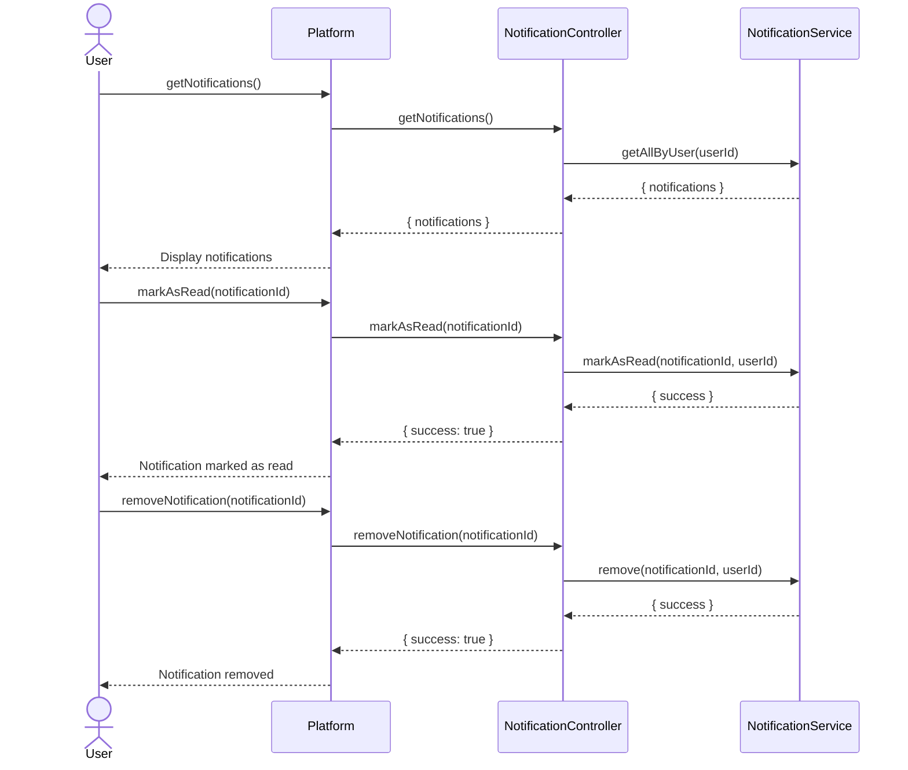
```mermaid
sequenceDiagram
    actor User
    participant Platform as Platform
    participant NotificationController as NotificationController
    participant NotificationService as NotificationService

    User->>Platform: getNotifications()
    Platform->>NotificationController: getNotifications()
    NotificationController->>NotificationService: getAllByUser(userId)
    NotificationService-->>NotificationController: { notifications }
    NotificationController-->>Platform: { notifications }
    Platform-->>User: Display notifications

    User->>Platform: markAsRead(notificationId)
    Platform->>NotificationController: markAsRead(notificationId)
    NotificationController->>NotificationService: markAsRead(notificationId, userId)
    NotificationService-->>NotificationController: { success }
    NotificationController-->>Platform: { success: true }
    Platform-->>User: Notification marked as read

    User->>Platform: removeNotification(notificationId)
    Platform->>NotificationController: removeNotification(notificationId)
    NotificationController->>NotificationService: remove(notificationId, userId)
    NotificationService-->>NotificationController: { success }
    NotificationController-->>Platform: { success: true }
    Platform-->>User: Notification removed
```

---

## SD-15: Student Dashboard and Schedule

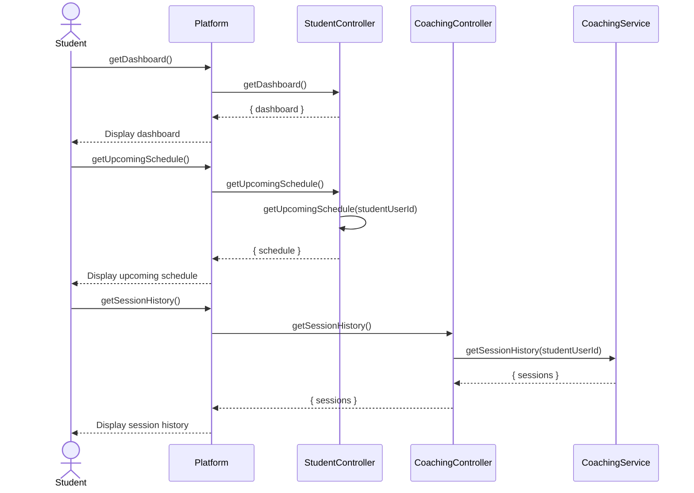
```mermaid
sequenceDiagram
    actor Student
    participant Platform as Platform
    participant StudentController as StudentController
    participant CoachingController as CoachingController

    Student->>Platform: getDashboard()
    Platform->>StudentController: getDashboard()
    StudentController-->>Platform: { dashboard }
    Platform-->>Student: Display dashboard

    Student->>Platform: getUpcomingSchedule()
    Platform->>StudentController: getUpcomingSchedule()
    StudentController->>StudentController: getUpcomingSchedule(studentUserId)
    StudentController-->>Platform: { schedule }
    Platform-->>Student: Display upcoming schedule

    Student->>Platform: getSessionHistory()
    Platform->>CoachingController: getSessionHistory()
    CoachingController->>CoachingService: getSessionHistory(studentUserId)
    CoachingService-->>CoachingController: { sessions }
    CoachingController-->>Platform: { sessions }
    Platform-->>Student: Display session history
```

---

## SD-16: Teacher Dashboard and Today Schedule

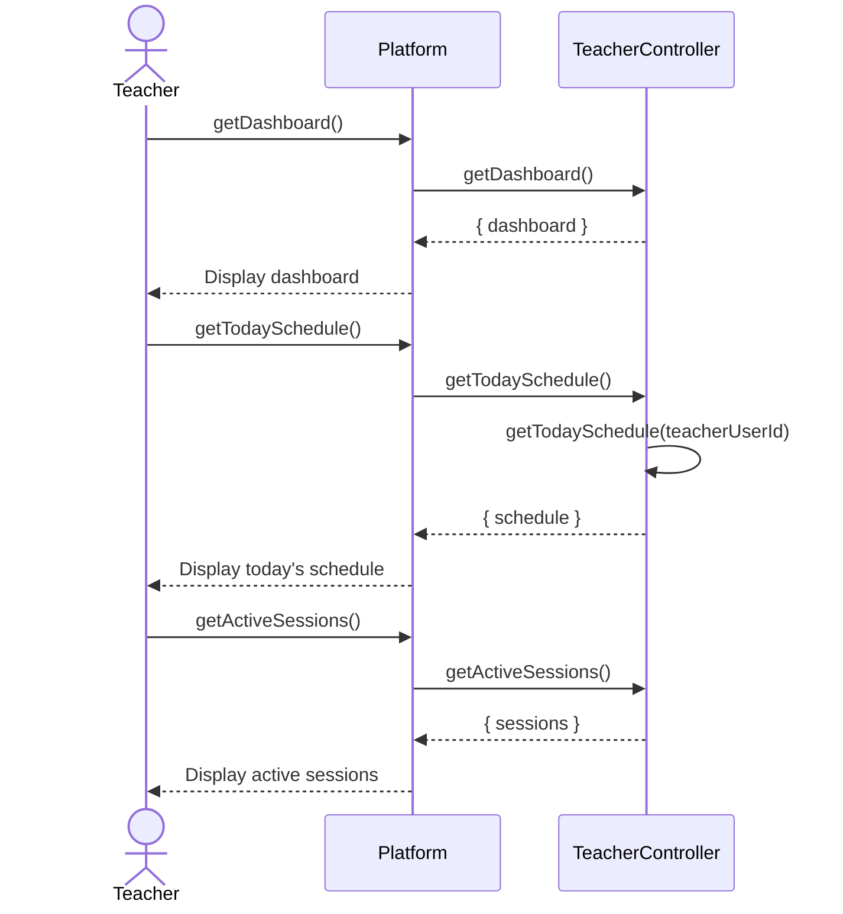
```mermaid
sequenceDiagram
    actor Teacher
    participant Platform as Platform
    participant TeacherController as TeacherController

    Teacher->>Platform: getDashboard()
    Platform->>TeacherController: getDashboard()
    TeacherController-->>Platform: { dashboard }
    Platform-->>Teacher: Display dashboard

    Teacher->>Platform: getTodaySchedule()
    Platform->>TeacherController: getTodaySchedule()
    TeacherController->>TeacherController: getTodaySchedule(teacherUserId)
    TeacherController-->>Platform: { schedule }
    Platform-->>Teacher: Display today's schedule

    Teacher->>Platform: getActiveSessions()
    Platform->>TeacherController: getActiveSessions()
    TeacherController-->>Platform: { sessions }
    Platform-->>Teacher: Display active sessions
```

---

## SD-17: Admin Dashboard and Operational Summary

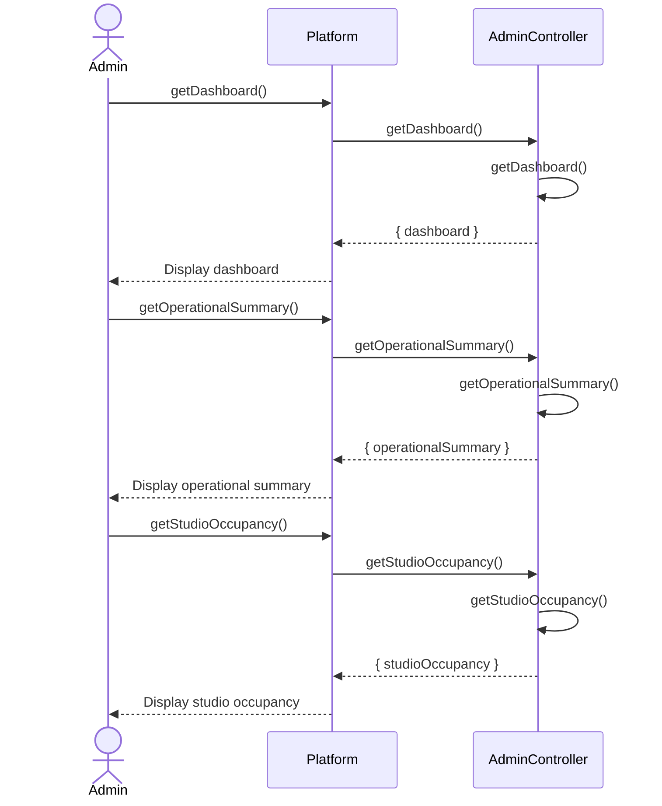
```mermaid
sequenceDiagram
    actor Admin
    participant Platform as Platform
    participant AdminController as AdminController

    Admin->>Platform: getDashboard()
    Platform->>AdminController: getDashboard()
    AdminController->>AdminController: getDashboard()
    AdminController-->>Platform: { dashboard }
    Platform-->>Admin: Display dashboard

    Admin->>Platform: getOperationalSummary()
    Platform->>AdminController: getOperationalSummary()
    AdminController->>AdminController: getOperationalSummary()
    AdminController-->>Platform: { operationalSummary }
    Platform-->>Admin: Display operational summary

    Admin->>Platform: getStudioOccupancy()
    Platform->>AdminController: getStudioOccupancy()
    AdminController->>AdminController: getStudioOccupancy()
    AdminController-->>Platform: { studioOccupancy }
    Platform-->>Admin: Display studio occupancy
```

---

## SD-18: Auth Token Refresh

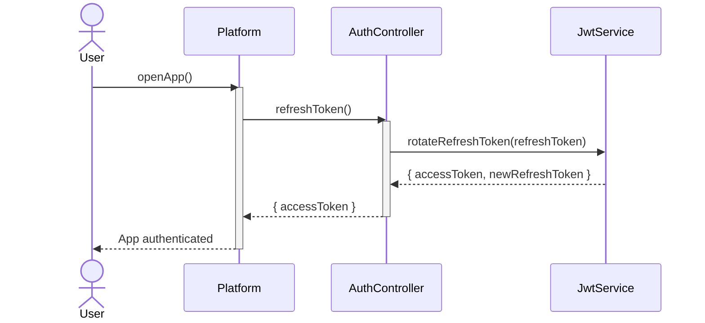
```mermaid
sequenceDiagram
    actor User
    participant Platform as Platform
    participant AuthController as AuthController
    participant JwtService as JwtService

    User->>Platform: openApp()
    activate Platform
    Platform->>AuthController: refreshToken()
    activate AuthController
    AuthController->>JwtService: rotateRefreshToken(refreshToken)
    JwtService-->>AuthController: { accessToken, newRefreshToken }
    AuthController-->>Platform: { accessToken }
    deactivate AuthController
    Platform-->>User: App authenticated
    deactivate Platform
```

---

## SD-19: Role Switch

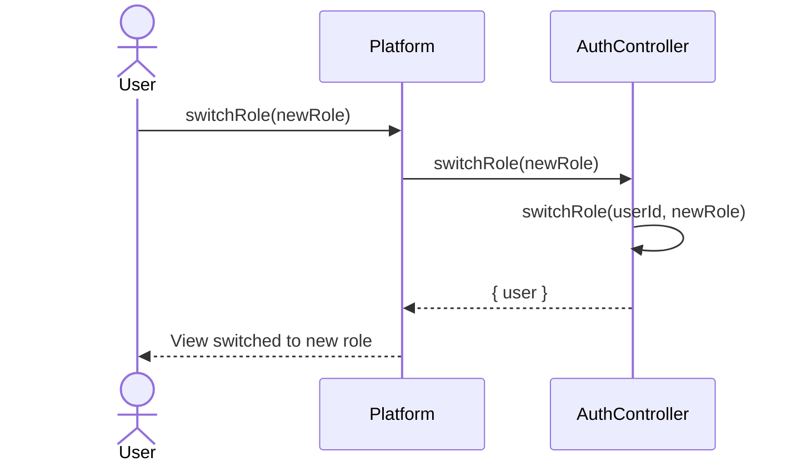
```mermaid
sequenceDiagram
    actor User
    participant Platform as Platform
    participant AuthController as AuthController

    User->>Platform: switchRole(newRole)
    Platform->>AuthController: switchRole(newRole)
    AuthController->>AuthController: switchRole(userId, newRole)
    AuthController-->>Platform: { user }
    Platform-->>User: View switched to new role
```

---

## SD-20: Admin Session Approval (Legacy)

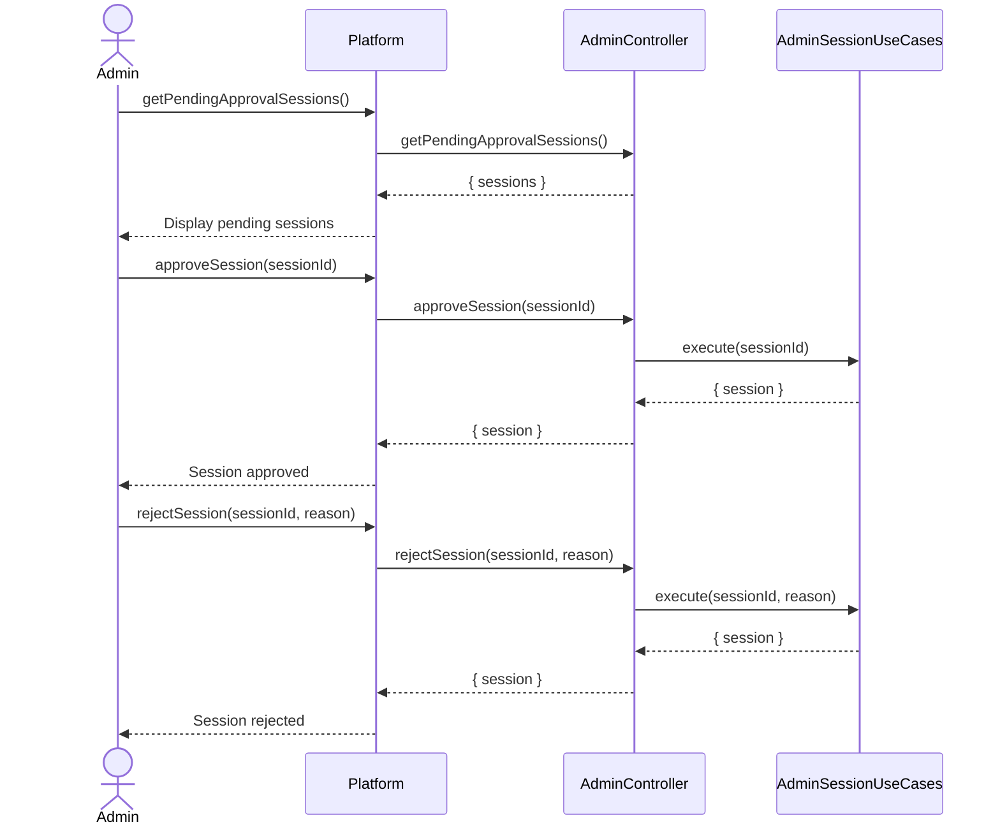
```mermaid
sequenceDiagram
    actor Admin
    participant Platform as Platform
    participant AdminController as AdminController
    participant AdminSessionUseCases as AdminSessionUseCases

    Admin->>Platform: getPendingApprovalSessions()
    Platform->>AdminController: getPendingApprovalSessions()
    AdminController-->>Platform: { sessions }
    Platform-->>Admin: Display pending sessions

    Admin->>Platform: approveSession(sessionId)
    Platform->>AdminController: approveSession(sessionId)
    AdminController->>AdminSessionUseCases: execute(sessionId)
    AdminSessionUseCases-->>AdminController: { session }
    AdminController-->>Platform: { session }
    Platform-->>Admin: Session approved

    Admin->>Platform: rejectSession(sessionId, reason)
    Platform->>AdminController: rejectSession(sessionId, reason)
    AdminController->>AdminSessionUseCases: execute(sessionId, reason)
    AdminSessionUseCases-->>AdminController: { session }
    AdminController-->>Platform: { session }
    Platform-->>Admin: Session rejected
```
