## SD-01: User Authentication

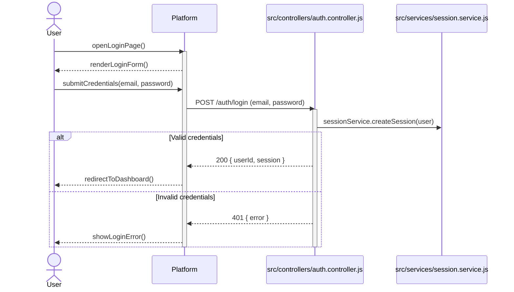

---

## SD-02: Coaching Session Booking Request

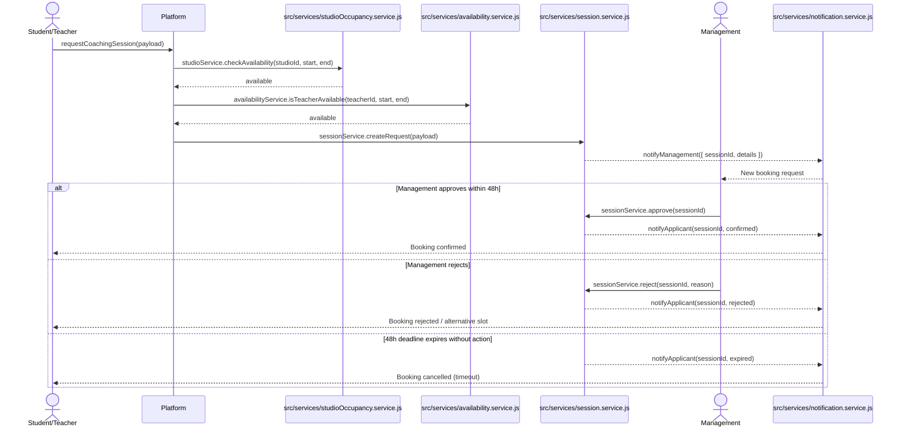

---

## SD-03: Post-Coaching Double Validation

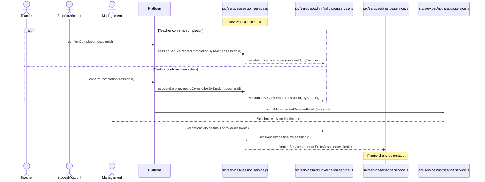

---

## SD-04: Session Cancellation with Justification

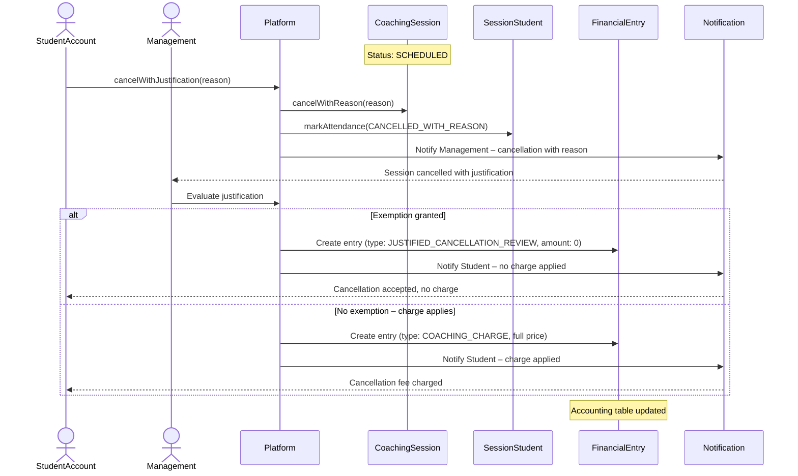

---

## SD-05: No-Show Recording

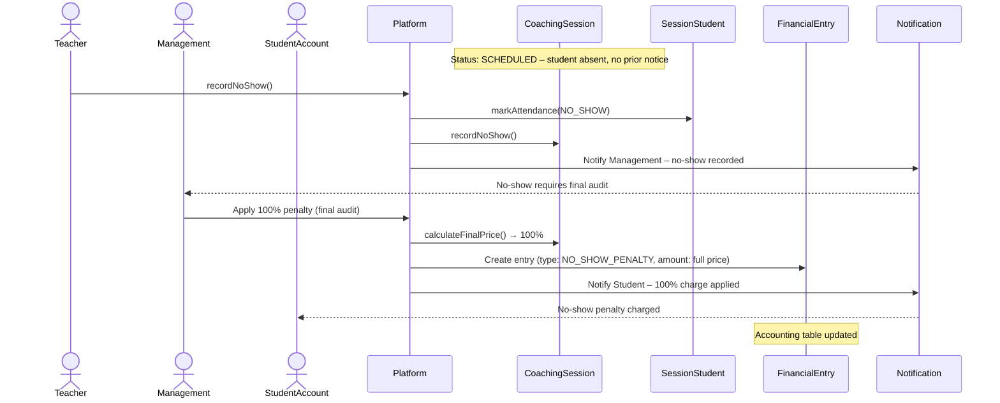

---

## SD-06: Student Join Request to Existing Session

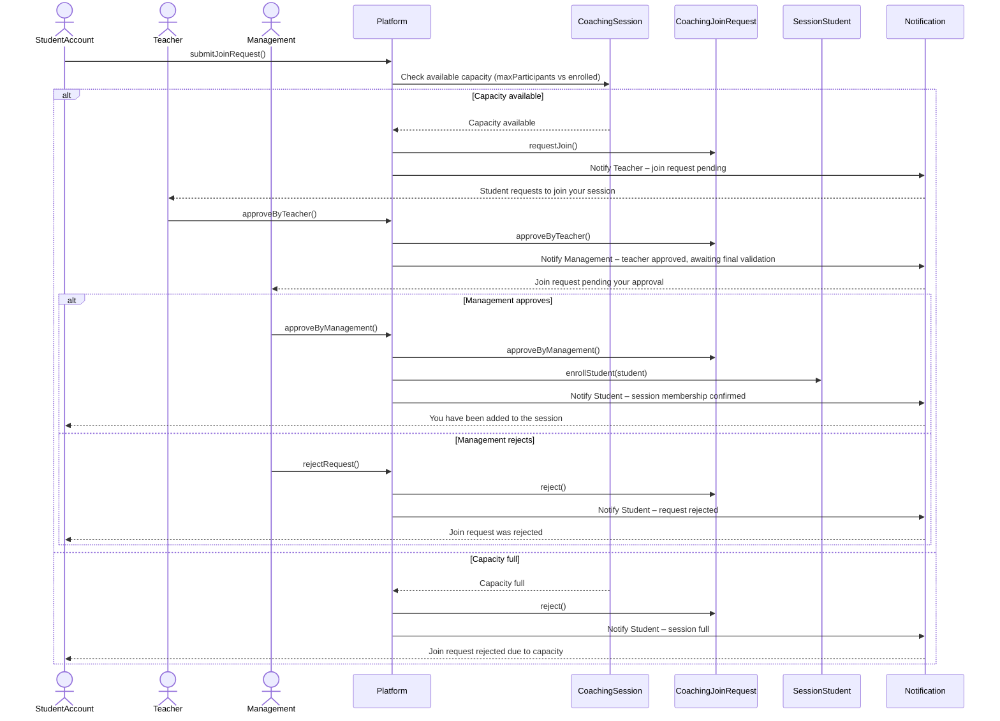

---

## SD-07: Teacher Availability Setup

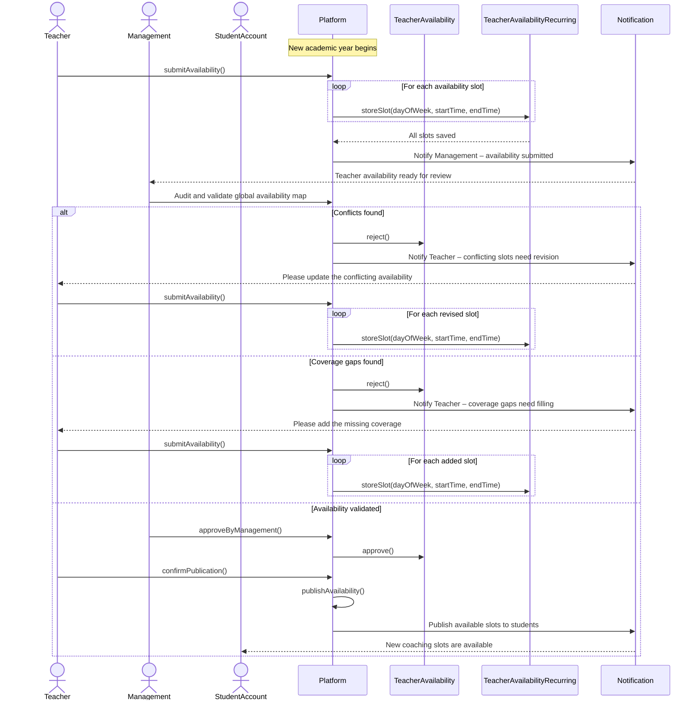

---

## SD-08: School Inventory Rental

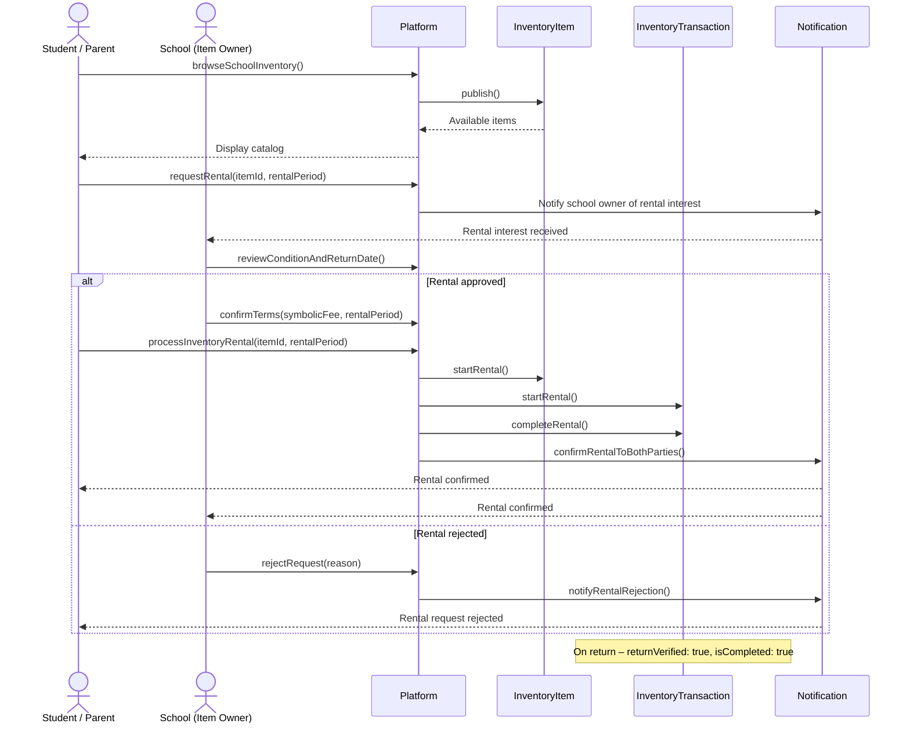

---

## SD-09: Community Marketplace Transaction

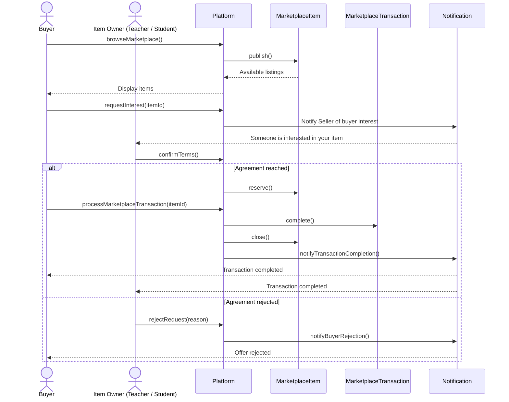

---

## SD-10: Financial Summary Generation and Export

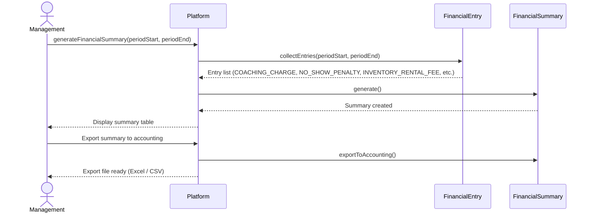

---

## SD-11: Lost and Found – Manage and View

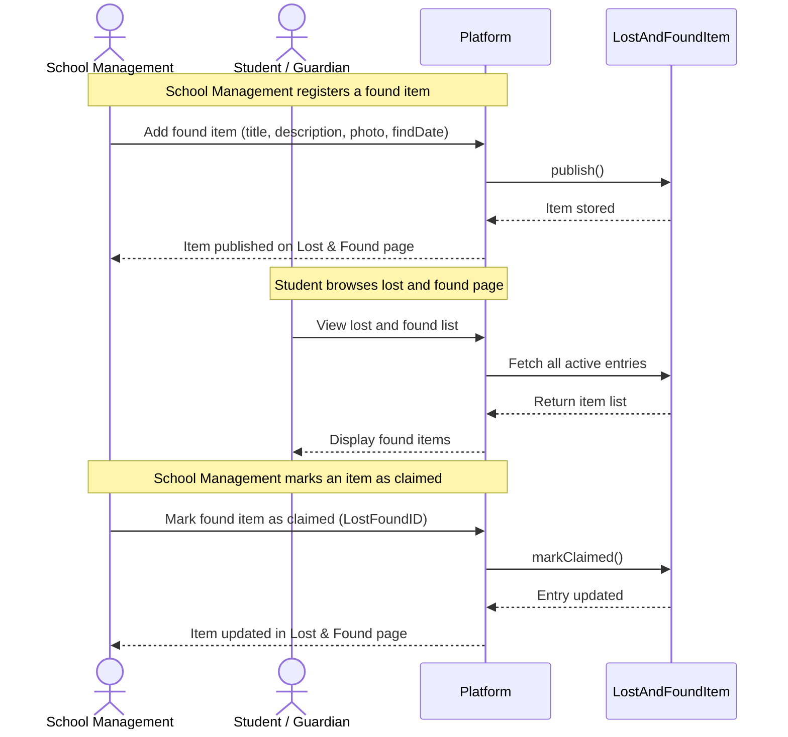
