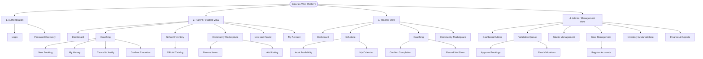

```mermaid
graph TD
    Root([Entartes Web Platform]) --> Auth[1. Authentication]
    Root --> EE[2. Parent / Student View]
    Root --> Prof[3. Teacher View]
    Root --> Admin[4. Admin / Management View]

    Auth --> Login[Login]
    Auth --> Recup[Password Recovery]

    EE --> EEDash[Dashboard]
    EE --> EECoach[Coaching]
    EE --> EESchInv[School Inventory]
    EE --> EEMarket[Community Marketplace]
    EE --> EEPyA[Lost and Found]
    EE --> EEConta[My Account]

    EECoach --> EECoach1[New Booking]
    EECoach --> EECoach2[My History]
    EECoach --> EECoach3[Cancel & Justify]
    EECoach --> EECoach4[Confirm Execution]

    EESchInv --> EESchInv1[Official Catalog]
    
    EEMarket --> EEMarket1[Browse Items]
    EEMarket --> EEMarket2[Add Listing]

    Prof --> ProfDash[Dashboard]
    Prof --> ProfAg[Schedule]
    Prof --> ProfCoach[Coaching]
    Prof --> ProfMarket[Community Marketplace]

    ProfAg --> ProfAg1[Input Availability]
    ProfAg --> ProfAg2[My Calendar]
    
    ProfCoach --> ProfCoach1[Confirm Completion]
    ProfCoach --> ProfCoach2[Record No-Show]

    Admin --> AdDash[Dashboard Admin]
    Admin --> AdVal[Validation Queue]
    Admin --> AdEst[Studio Management]
    Admin --> AdUsers[User Management]
    Admin --> AdInv[Inventory & Marketplace]
    Admin --> AdFin[Finance & Reports]

    AdVal --> AdVal1[Approve Bookings]
    AdVal --> AdVal2[Final Validations]
    AdUsers --> AdUsers1[Register Accounts]
```