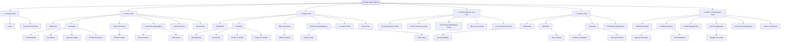

```mermaid
graph TD
    Root([Entartes Web Platform]) --> Auth[1. Authentication]
    Root --> Parent[2. Parent View]
    Root --> Student[3. Student View]
    Root --> Minor["4. Student (Minor) View Only"]
    Root --> Prof[5. Teacher View]
    Root --> Admin[6. Admin / Management View]

    Auth --> Login[Login]
    Auth --> Recup[Password Recovery]

    Parent --> ParentDash[Dashboard]
    Parent --> ParentCoach[Coaching]
    Parent --> ParentSchInv[School Inventory]
    Parent --> ParentMarket[Community Marketplace]
    Parent --> ParentPyA[Lost and Found]
    Parent --> ParentConta[My Account]

    ParentCoach --> ParentCoach1[New Booking]
    ParentCoach --> ParentCoach2[My History]
    ParentCoach --> ParentCoach3[Cancel & Justify]
    ParentCoach --> ParentCoach4[Confirm Execution]

    ParentSchInv --> ParentSchInv1[Official Catalog]
    
    ParentMarket --> ParentMarket1[Browse Items]
    ParentMarket --> ParentMarket2[Add Listing]

    Student --> StudentDash[Dashboard]
    Student --> StudentCoach[Coaching]
    Student --> StudentSchInv[School Inventory]
    Student --> StudentMarket[Community Marketplace]
    Student --> StudentPyA[Lost and Found]
    Student --> StudentConta[My Account]

    StudentCoach --> StudentCoach1[New Booking]
    StudentCoach --> StudentCoach2[My History]
    StudentCoach --> StudentCoach3[Cancel & Justify]
    StudentCoach --> StudentCoach4[Confirm Execution]

    StudentSchInv --> StudentSchInv1[Official Catalog]

    StudentMarket --> StudentMarket1[Browse Items]
    StudentMarket --> StudentMarket2[Add Listing]

    Minor --> MinorCoach["Coaching History (View)"]
    Minor --> MinorSchInv["School Inventory (View)"]
    Minor --> MinorMarket["Community Marketplace (View)"]
    Minor --> MinorConta["My Account (View)"]
    Minor --> MinorPyA["Lost and Found (View)"]

    Prof --> ProfDash[Dashboard]
    Prof --> ProfAg[Schedule]
    Prof --> ProfCoach[Coaching]
    Prof --> ProfMarket[Community Marketplace]

    ProfAg --> ProfAg1[Input Availability]
    ProfAg --> ProfAg2[My Calendar]
    
    ProfCoach --> ProfCoach1[Confirm Completion]
    ProfCoach --> ProfCoach2[Record No-Show]

    Admin --> AdDash[Dashboard Admin]
    Admin --> AdVal[Validation Queue]
    Admin --> AdEst[Studio Management]
    Admin --> AdUsers[User Management]
    Admin --> AdInv[Inventory & Marketplace]
    Admin --> AdFin[Finance & Reports]

    AdVal --> AdVal1[Approve Bookings]
    AdVal --> AdVal2[Final Validations]
    AdUsers --> AdUsers1[Register Accounts]

```