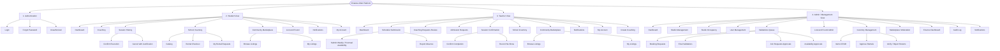

```mermaid
graph TD
    Root([Entartes Web Platform]) --> Auth[1. Authentication]
    Root --> EE[2. Student View]
    Root --> Prof[3. Teacher View]
    Root --> Admin[4. Admin / Management View]

    %% ── Authentication ─────────────────────────────────────
    Auth --> Login[Login]
    Auth --> Recup[Forgot Password]
    Auth --> Unauth[Unauthorized]

    %% ── Student ────────────────────────────────────────────
    EE --> EEDash[Dashboard]
    EE --> EECoach[Coaching]
    EE --> EEHist[Session History]
    EE --> EESchInv[School Inventory]
    EE --> EEMarket[Community Marketplace]
    EE --> EELost[Lost and Found]
    EE --> EENotif[Notifications]
    EE --> EEConta[My Account]

    EESchInv --> EESchInv1[Catalog]
    EESchInv --> EESchInv2[Rental Checkout]
    EESchInv --> EESchInv3[My Rental Requests]

    EEMarket --> EEMarket1[Browse Listings]
    EEMarket --> EEMarket2[My Listings]

    EEHist --> EEHist1[Confirm Execution]
    EEHist --> EEHist2[Cancel with Justification]

    %% ── Teacher ────────────────────────────────────────────
    Prof --> ProfDash[Dashboard]
    Prof --> ProfAg[Schedule Submission]
    Prof --> ProfCoach[Coaching Requests Review]
    Prof --> ProfAdm[Admission Requests]
    Prof --> ProfConf[Session Confirmation]
    Prof --> ProfInv[School Inventory]
    Prof --> ProfMarket[Community Marketplace]
    Prof --> ProfNotif[Notifications]
    Prof --> ProfConta[My Account]
    Prof --> ProfCreate[Create Coaching]

    ProfAg --> ProfAg1[Submit Weekly / Punctual Availability]
    ProfAg --> ProfAg2[Report Absence]

    ProfConf --> ProfConf1[Confirm Completion]
    ProfConf --> ProfConf2[Record No-Show]

    ProfMarket --> ProfMarket1[Browse Listings]
    ProfMarket --> ProfMarket2[My Listings]

    %% ── Admin ──────────────────────────────────────────────
    Admin --> AdDash[Dashboard]
    Admin --> AdEst[Studio Management]
    Admin --> AdOcc[Studio Occupancy]
    Admin --> AdUsers[User Management]
    Admin --> AdVal[Validations Queue]
    Admin --> AdLost[Lost and Found Admin]
    Admin --> AdInv[Inventory Management]
    Admin --> AdMkt[Marketplace Moderation]
    Admin --> AdFin[Finance Dashboard]
    Admin --> AdAud[Audit Log]
    Admin --> AdNotif[Notifications]

    AdVal --> AdVal1[Booking Requests]
    AdVal --> AdVal2[Final Validations]
    AdVal --> AdVal3[Join Requests Approvals]
    AdVal --> AdVal4[Availability Approvals]

    AdInv --> AdInv1[Items CRUD]
    AdInv --> AdInv2[Approve Rentals]
    AdInv --> AdInv3[Verify / Reject Returns]
```
