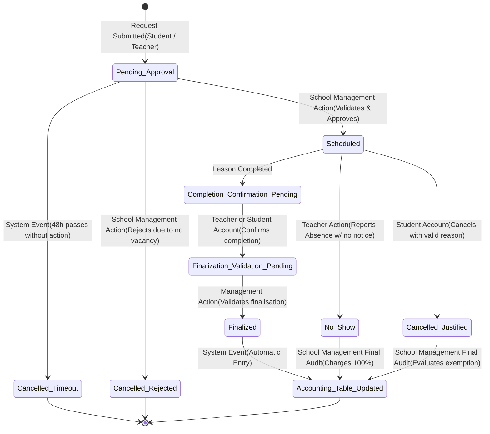

```mermaid
stateDiagram-v2
    direction TB

    %% Request start
    [*] --> Pending_Approval : Request Submitted(Student / Teacher)

    %% Booking validation
    Pending_Approval --> Scheduled : School Management Action(Validates & Approves)
    Pending_Approval --> Cancelled_Timeout : System Event(48h passes without action)
    Pending_Approval --> Cancelled_Rejected : School Management Action(Rejects due to no vacancy)

    %% Post-coaching validation flow (Teacher or Student confirms, then Management finalises)
    Scheduled --> Completion_Confirmation_Pending : Lesson Completed
    Completion_Confirmation_Pending --> Finalization_Validation_Pending : Teacher or Student Account(Confirms completion)
    Finalization_Validation_Pending --> Finalized : Management Action(Validates finalisation)

    %% Automatic accounting update
    Finalized --> Accounting_Table_Updated : System Event(Automatic Entry)

    %% Exception flow during scheduled lesson
    Scheduled --> No_Show : Teacher Action(Reports Absence w/ no notice)
    Scheduled --> Cancelled_Justified : Student Account(Cancels with valid reason)

    No_Show --> Accounting_Table_Updated : School Management Final Audit(Charges 100%)
    Cancelled_Justified --> Accounting_Table_Updated : School Management Final Audit(Evaluates exemption)

    %% Final states
    Cancelled_Timeout --> [*]
    Cancelled_Rejected --> [*]
    Accounting_Table_Updated --> [*]
```

