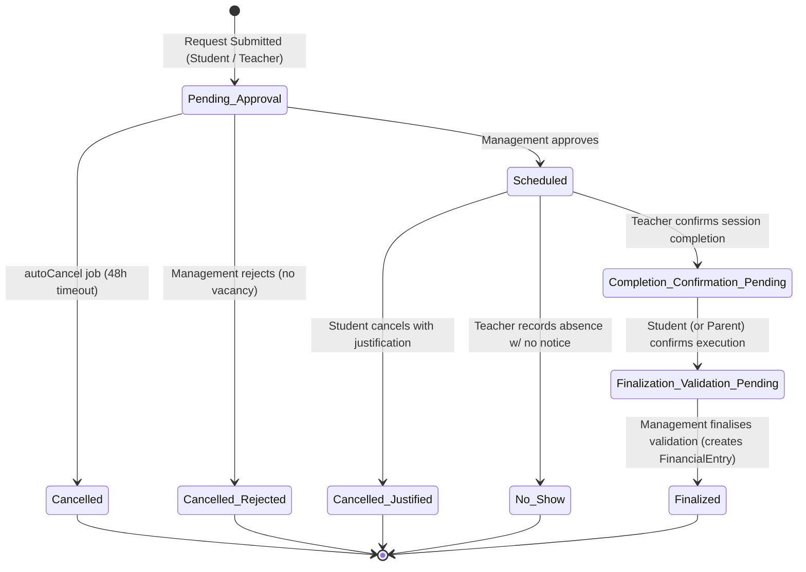

```mermaid
stateDiagram-v2
    direction TB

    %% Request start (Pending_Approval is seeded in DB)
    [*] --> Pending_Approval : Request Submitted (Student / Teacher)

    %% Booking validation (Scheduled is auto-created by approve-session.usecase.js)
    Pending_Approval --> Scheduled : Management approves
    Pending_Approval --> Cancelled : autoCancel job (48h timeout)
    Pending_Approval --> Cancelled_Rejected : Management rejects (no vacancy)

    %% Post-coaching validation flow (Teacher confirms, then Student/Parent confirms, then Management finalises)
    Scheduled --> Completion_Confirmation_Pending : Teacher confirms session completion
    Completion_Confirmation_Pending --> Finalization_Validation_Pending : Student (or Parent) confirms execution
    Finalization_Validation_Pending --> Finalized : Management finalises validation (creates FinancialEntry)

    %% Exception flows during scheduled lesson
    Scheduled --> No_Show : Teacher records absence w/ no notice
    Scheduled --> Cancelled_Justified : Student cancels with justification

    %% Final states (FinancialEntry is generated as part of Finalized transition)
    Cancelled --> [*]
    Cancelled_Rejected --> [*]
    Cancelled_Justified --> [*]
    No_Show --> [*]
    Finalized --> [*]
```