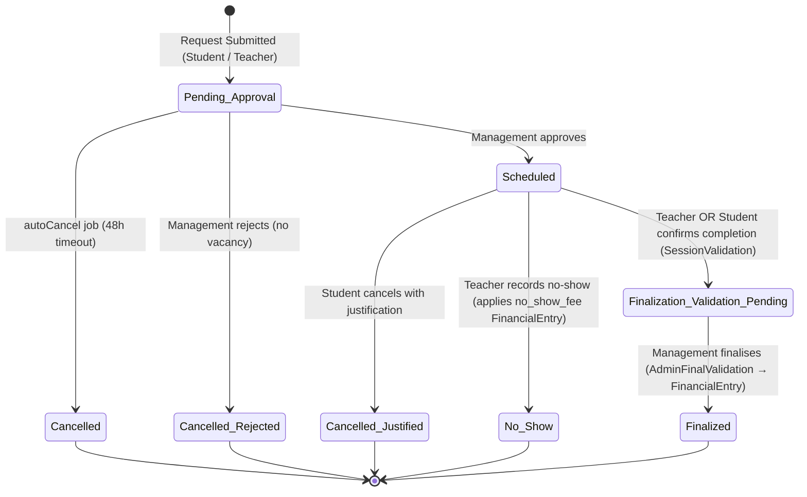

```mermaid
stateDiagram-v2
    direction TB

    %% Request start (Pending_Approval is seeded in DB)
    [*] --> Pending_Approval : Request Submitted (Student / Teacher)

    %% Booking validation ('Scheduled' is resolve-or-created by approve-session.usecase.js;
    %% 'Cancelled_Rejected' by reject-session.usecase.js)
    Pending_Approval --> Scheduled : Management approves
    Pending_Approval --> Cancelled : autoCancel job (48h timeout)
    Pending_Approval --> Cancelled_Rejected : Management rejects (no vacancy)

    %% Post-coaching validation flow.
    %% NOTE (as-built): in the current code EITHER the teacher (teacher.controller.confirmCompletion)
    %% OR the student (coaching.service.confirmCompletion) confirmation moves the session
    %% straight to Finalization_Validation_Pending via a SessionValidation row.
    %% The 'Completion_Confirmation_Pending' status is seeded but is not currently set
    %% as a transition target.
    Scheduled --> Finalization_Validation_Pending : Teacher OR Student confirms completion (SessionValidation)
    Finalization_Validation_Pending --> Finalized : Management finalises (AdminFinalValidation → FinancialEntry)

    %% Exception flows during scheduled lesson
    Scheduled --> No_Show : Teacher records no-show (applies no_show_fee FinancialEntry)
    Scheduled --> Cancelled_Justified : Student cancels with justification

    %% Final states (the session_revenue FinancialEntry is generated as part of the Finalized transition;
    %% the no_show_fee FinancialEntry is generated at the No_Show transition)
    Cancelled --> [*]
    Cancelled_Rejected --> [*]
    Cancelled_Justified --> [*]
    No_Show --> [*]
    Finalized --> [*]
```